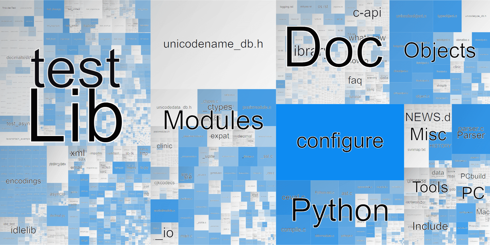

# Git-Heat-Map

*Map showing the cpython repositiory, highlighting the files that Guido van Rossum changed the most (excluding the configure file in the root directory)*

## Basic use guide

* Generate database with `./generate-db.sh {path_to_repo_dir}`
* Generate filetree json with `python databaseToJSON.py {name_of_repo}.db > filetree.json`
* Add the emails you'd like to search for to the example emails list in `databaseToJSONFiltered.py`
* Generate highlighting json with `python databaseToJSONFiltered.py {name_of_repo}.db > filetree.json`
* Run web server with `python flask_app.py` (flask must be installed, can be install from pip)
* Connect on `127.0.0.1:5000`

This project consists of two parts:

1. Git log -> database
2. Database -> treemap

## Git log -> database

Scans through an entire git history using `git log`, and creates a database using three tables:
* *Files*, which just keeps track of filenames
* *Commits*, which stores commit hash, author, committer
* *CommitFile*, which stores an instance of a certain file being changed by a certain commit, and tracks how many lines were added/removed by that commit

Using these we can keep track of which files/commits changed the repository the most, which in itself can provide useful insight

### Planned features

#### Submodule tracking
Currently the only submodule changes that can be seen are the top level commit pointer changes. In the future would like to recursively explore submodules and add their files to the database.

## Database -> treemap

Taking the database above, shall calculate a [treemap](https://en.wikipedia.org/wiki/Treemapping "Wikipedia: Treemapping") of the file system, with the size of each directory being the sum of the sizes of the files contained within, and the size of each file being either the size on disk, or the number of changed lines of code across all commits in the database.

### Planned features

#### Filtering by author(s) to see which areas of a codebase people touch most
